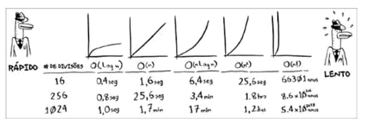

## A notação Big O é uma notação que diz o quão rápido é um algoritmo. 

Se você possui uma lista com tamanho n. O tempo de executação na notação Big O é O(n). 

A notação Big O não fornece o tempo em segundos, ela permite que você compare o número de operações. Ela informa o quão rapidamente um algoritmo cresce.

A pesquisa binária precisa de log n operações para verificar uma lista de tamanho n. Em Big O é O(log n). 

Algoritmo 1:
Uma forma de desenhar uma grade de 16 divisões é desenhar uma divisão de cada vez. 
É necessário passar por 16 etapas para desenhar 16 divisões.

R => Será necessária 16 etapas, portanto, O(n)

Algoritmo 2:
Neste algoritmo, dobrar o papel uma vez é uma operação. Você fez duas divisões com essa operação. Dobre de novo, de novo...
Depois de quatro dobras você terá uma grade com 16 divisões. 

R => Será necessário 4 etapas, portanto 
O(log n)

A notação Big O estabele o tempo de execução para a pior hipótese.

## Alguns exemplos comuns de tempo de execução Big O

. O(log n), também conhecido como tempo logarítmico. Ex.: Pesquisa binária

. O(n), conhecido como tempo linear. Ex.: Pesquisa binária

. O(n * log n) Ex.: Um algoritmo rápido de ordenação, como a ordenação por seleção

. O(n!) Ex.: Um algoritmo bastante lento, como o do caixeiro-viajante.

# Alguns pontos importantes:
. A rapidez de um algoritmo não é medida em segundos, mas pelo crescimento do número de operações.

. Em vez disso, discutimos sobre o quão rapidamente o tempo de execução de um algoritmo aumenta conforme o número de elementos muda.

. O tempo de execução em algoritmos é expresso na notação Big O.

. O (log n) é mais rápido do que O(n), e 
O(log n) fica ainda mais rápido conforme a lista aumenta.