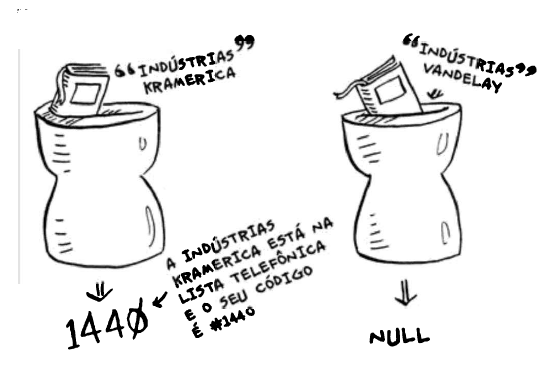

Supondo que você está procurando o nome de uma pessoa chamada "Pablo" em uma lista que está ordenada por ordem alfabética. O ideal seria você pela letra "M" ou "N", já que são as letras do meio do alfabeto. 
Portanto, você cortaria outras 12 letras, o que facilitaria demais a busca.

Esse é um problema de busca que você resolve por pesquisa binária.

A pesquisa binária é um algoritmo. Sua entrada é uma lista ordenada de elementos. Se o elemento que você está buscando está na lista, a pesquisa binária retorna a sua localização. Caso contrário, a pesquisa binária retorna None.

Um dicionário com 240.000 palavras. Na pior das hipóteses precisariamos de 240.000 etapas na pesquisa simples e APENAS 18 ETAPAS na pesquisa binária.

De maneira geral, para uma lista de n números, a pesquisa binária precisaria de log2 n para retornar o valor correto, enquanto a pesquisa simples precisa de n etapas.

Se fosse uma lista de 100 números, precisaríamos de 100 tentativas. Se fosse uma lista de 4 bilhões de números, precisaríamos de 4 bilhões de tentativas. Logo, o número máximo de tentativas é igual ao tamanho da lista. Isso é chamado de tempo linear.