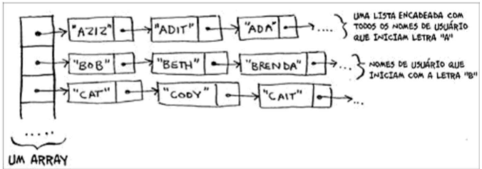

# Suponha que você esteja criando um aplicativo para anotar os pedidos dos clientes em um restaurante. Seu aplicativo precisa de uma lista de pedidos. Os garçons adicionam os pedidos a essa lista e os chefes retiram os pedidos da lista. Funciona como uma fila. Os garçons colocam os pedidos no final da fila e os chefes retiram os pedidos do começo dela para cozinhá-los.
# Você usaria um array ou uma lista encadeada para implementar essa lista? (Dica: listas encadeadas são boas para inserções/eliminações e arrays são bons para acesso aleatório. O que fazer nesse caso?)

-> Eu usaria lista encadeada visto a facilidade para as inserções dos pedidos. Ademais, é necessário que eu complete o #1 pedido para começar o #2 pedido, portanto, não iria fazer sentido um acesso aleatório. 

# Vamos analisar um experimento. Imagine que o Facebook guarda uma lista de usuários. Quando alguém tenta acessar o Facebook, uma busca é feita pelo nome de usuário. Se o nome da pessoa está na lista, ela pode continuar o acesso. As pessoas acessam o Facebook com muita frequência, então existem muitas buscas nessa lista. Presuma que o Facebook usa a pesquisa binária para procurar um nome na lista. A pesquisa binária requer acesso aleatório - você precisa ser capaz de acessar o meio da lista de nomes instantaneamente. Sabendo disso, você implementaria essa lista como um array ou uma lista encadeada?

-> Visto que é necessário ter acesso aleatório faz mais sentido utilizar arrays, visto que eu conseguiria acessar o meio da lista facilmente. Diferentemente de uma lista encadeada porque eu não sei qual é o meio sem ter que passar pelos nomes anteriores até chegar ao meio, Ex.: nome #1, nome #2, nome #3...

# As pessoas se inscrevem no Facebook com muita frequência também. Suponha que você decida usar um array para armazenar a lista de usuários. Quais as desvantagens de um array em relação às inserções? Em particular, imagine que você está usando a pesquisa binária para buscar os logins. O que acontece quando você adiciona novos usuários em um array?

-> A desvantagem de utilizar array para fazer inserções de nomes é que são O(n). A pesquisa binária exige que os nomes estejam ordenados, um novo usuário não pode ser simplesmente colocado em qualquer posição ou sempre no final do array. Primeiro, é necessário encontrar a posição correta em que o nome deve ser inserido.

Embora seja possível encontrar a posição correta com pesquisa binária em O(log n), o deslocamento dos elementos pode exigir O(n) operações.

Além disso, caso o array esteja completamente ocupado, pode ser necessário criar um array maior e copiar todos os elementos para ele, o que também possui complexidade O(n).

A maior desvantagem é inserir novos usuários mantendo a lista ordenada por causa do O(n)

# Na verdade, o Facebook não usa nem arrays nem listas encadeadas para armazenar informações. Vamos considerar uma estrutura de dados híbrida: um array de listas encadeadas. Você tem um array com 26 slots. Cada slot aponta uma lista encadeada. Por exemplo, o primeiro slot do array aponta para uma lista encadeada que contém os usuários que começam com a letra A. O segundo slot aponta para a lista encadeada que contém os usuários que começam com a letra B, e assim por diante.
