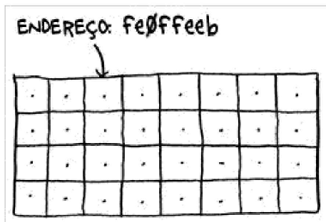
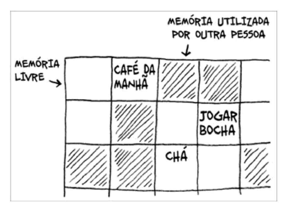
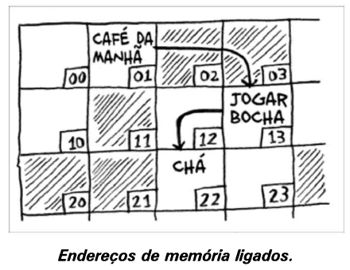
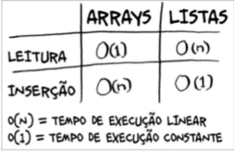
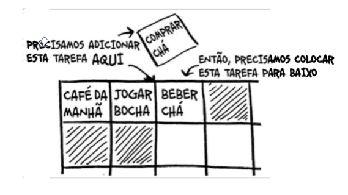
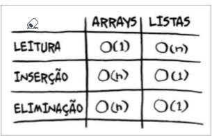

# Como funciona a memória
O computador se parece com um grande conjunto de gavetas, e cada gaveta tem o seu endereço.

feOffeeb é o endereço de um slot na memória

Cada vez que armazenar um item na memória, você pede ao computador um pouco de espaço e ele te dá um endereço no qual você pode armazenar o seu item. Se quiser armazenar múltiplos itens, existem duas maneiras para fazer isso: arrays e listas.

# Arrays
Usar um array significa que todas as suas tarefas estão armazenadas contiguamente (uma ao lado da outra) na memória.

Agora, suponha que você queira adicionar mais uma tarefa. No entanto, a próxima gaveta está ocupada por coisas de outra pessoa!

É como se você fosse ao cinema com seus amigos e encontrasse um lugar para sentar, mas outro amigo se juntasse a vocês e não houvesse lugar para ele. Vocês todos precisariam se mover e encontrar um lugar onde todos coubessem.
Neste caso, você precisaria solicitar ao computador uma área da memória em que coubessem todas as suas tarefas. Então você as moveria para lá.

Se outro amigo aparecesse, vocês ficariam sem lugar novamente - e todos precisariam se mover uma segunda vez!

# Listas encadeadas
Com as listas encadeadas, seus itens podem estar em qualquer lugar da memória

Cada item armazena o endereço do próximo item da lista. Um monte de endereços aleatórios de memória estão ligados.

Você vai ao primeiro endereço e ele diz "o próximo item pode ser encontrado no endereço 123". Então vai ao endereço 123 e ele diz "O próximo item pode ser encontrado no endereço 456", e assim por diante. Adicionar um item a uma lista encadeada é fácil: você coloca em qualquer lugar da memória e armazena o endereço do item anterior.

Com as listas encadeadas você nunca precisa mover os seus itens; também evita outro problema. Digamos que você vá ao cinema com seus amigos. Vocês seis estão tentando procurar um lugar para sentar, mas o cinema está cheio. Não há seis lugares juntos. Bem, usar uma lista encadeada seria como dizer "vamos nos dividir e assistir o filme". Se existir espaço na memória, você terá espaço para a sua lista encadeada.

# Mais sobre arrays
Os websites que apresentam listas "top 10" usam uma tática trapaceira para conseguir mais visualizações. Em vez de mostrarem a lista em uma única página, eles colocam um item em cada página e fazem você clicar em "próximo" para ler o item seguinte. Por exemplo, "Os 10 melhores vilões da TV" não estarão listados em uma única página, em vez disso, você começará pelo # 10 (Newman) e seguirá clicando em "próximo" até chegar em #1 (Gustavo Fring).

Essa técnica fornece aos sites dez páginas inteiras para incluir anúncios, mas fica chato ficar clicando em "próximo" nove vezes até chegar ao número 1. Seria muito melhor se a lista estivesse em uma única página e você pudesse clicar no nome de cada vilão para saber mais.

Listas encadeadas têm um problema similar. Suponha que você queira ler o último item de uma lista encadeada. Você não pode fazer isso porque não sabe o endereço dele. Em vez disso, precisa ir ao item # 1 para pegar o endereço do item # 2. Então, é necessário ir ao item # 2 para encontrar o endereço do item # 3, e assim por diante, até conseguir o endereço do último item. 

Listas encadeadas são ótimas se você quiser ler todos os itens, um de cada vez: você poder um item, seguir para o próximo item e fazer isso até o fim da lista. Mas se você quiser pular de um item para o outro, as listas encadeadas são terríveis.

Com arrays é diferente. Você sabe o endereço de cada item. Por exemplo, suponha que seu array tenha cinco itens e que você saiba que o primeiro item está no endereço 00. O endereço do item #5 é o 04.

Arrays são ótimos se você deseja ler elementos aleatórios, pois pode encontrar qualquer elemento instantaneamente em um array. 

Na lista encadeada, os elementos não estão próximos uns dos outros, então você não pode calcular instantaneamente a posição de um elemento na memória - precisa ir ao primeiro elemento para encontrar o endereço do seguindo, então ir ao segundo elemento para encontrar o endereço do tericeor e seguir fazendo isso até chegar ao elemento que deseja.

# Terminologia

Os elementos em um array são numerados. Essa numeração começa no 0, não no 1. E não usa-se índice no lugar de posição.

# Tempo de execução para operações comuns de arrays e listas

Por que é necessário tempo de execução O(n) para inserir um elemento em um array? Suponha que você queira inserir um elemento no começo de um array. Como faria isso? Quanto tempo levaria?

# Inserindo algo no meio da lista
Antes, você adicionava os itens ao final da lista. Agora, quer adicionar suas tarefas na ordem em que elas devem ser realizadas. Portanto, uma lista desordenada.

O que seria melhor se você quisesse inserir elementos no meio de uma lista: arrays ou listas encadeadas? Usando listas encadeadas, basta mudar o endereço para qual o elemento anterior está apontando.

Já para arrays, você deve mover todos os itens que estão abaixo do endereço de inserção.

Se não houver espaço, pode ser necessário mover tudo para um novo local! Por isso, listas encadeadas são melhores caso você queira inserir um elemento no meio de uma lista.

# Deleções

E se você quiser deletar um elemento? Novamente, é mais fácil fazer isso usando listas encadeadas, pois é necessário mudar apenas o endereço para o qual o elemento anterior está apontando. Com arrays, tudo precisa ser movido quando um elemento é eliminado.

Ao contrário do que ocorre com as inserções, a eliminação de elementos sempre funcionará. A inserção poderá falhar quando não houver espaço suficiente na memória.

Aqui estão os tempos de execução para as operações mais comuns em arrays e listas encadeadas.

Vale a pena mencionar que inserções e eliminações terão tempo de execução O(1) somente se você puder acessar instantaneamente o elemento a ser deletado. É uma prática comum acompanhar o primeiro e o último item de uma lista encadeada para que o tempo de execução para deletá-los seja O(1)

Entretanto, os arrays são mais comuns porque permitem acesso aleatório. Existem dois tipos de acesso: o aleatório e o sequencial. O sequencial significa ler os elementos, um por um, começando pelo primeiro. Listas encadeadas só podem lidar com acesso sequencial. Se você quiser ler o décimo elemnto de uma lista encadeada, primeiro precisará ler os nove elementos anteriores para chegar ao endereço do décimo elemento. 
O aleatório permite que você pule direto para o décimo elemento. Muitos casos requerem o acesso aleatório, o que faz os arrays serem mais utilizados. Arays e listas são usados para implementar outras estruturas de dados

